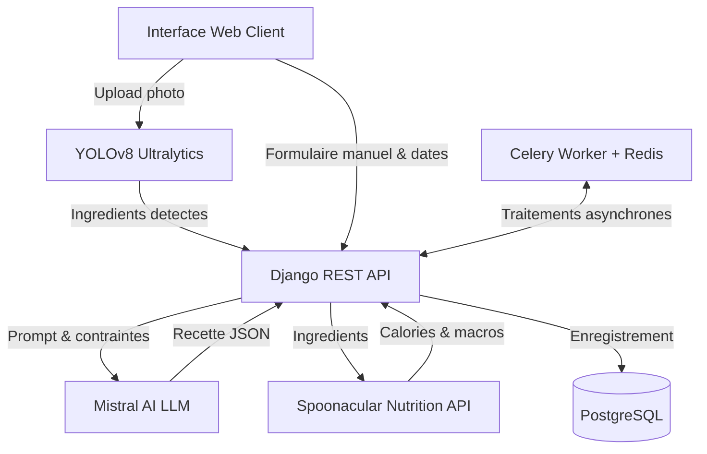
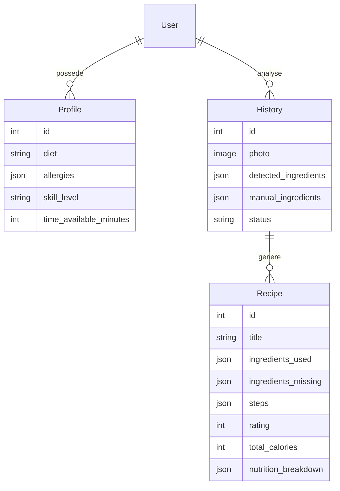

# CookPilot-AI

Plateforme web de generation de recettes anti-gaspillage basee sur la vision par ordinateur, un LLM et l'estimation nutritionnelle.

## Membres de l'equipe

| Nom et Prenom                  | Role     | Responsabilites                                                                 |
| ------------------------------ | -------- | ------------------------------------------------------------------------------- |
| Jacqueline MAPENZI             | Membre 1 | Backend Django, Moteur Vision YOLOv8, LLM Mistral, API Spoonacular, Celery      |
| Aya SGHAIER                    | Membre 2 | UI/UX Design System, Interface utilisateur, Skeletons d'attente, Notation       |
| Danielle Jamila Koagne Ngankam | Membre 3 | DevOps, Docker Compose, CI/CD GitHub Actions, Deploiement Render, Documentation |

- URL de production : https://cookpilot-ai.onrender.com
- Depot GitHub : https://github.com/104MJ/CookPilot-AI

## Architecture et fonctionnement

Le systeme combine une analyse d'image par vision artificielle et la generation de recettes personnalisees sous contraintes.



## ORM et Modeles de donnees



## Guide de lancement local

### Prerequis

- Docker Desktop
- Git

### Installation et demarrage

1. Cloner le depot :

```bash
git clone https://github.com/104MJ/CookPilot-AI.git
cd CookPilot-AI
```

2. Creer le fichier d'environnement local :

```bash
cp .env.example .env
```

3. Completer les cles d'API dans `.env` :

- `MISTRAL_API_KEY` : obtenue sur https://console.mistral.ai/ (rubrique API Keys)
- `SPOONACULAR_API_KEY` : obtenue sur https://spoonacular.com/food-api (compte gratuit)

4. Lancer les conteneurs :

```bash
docker compose up --build
```

L'application est disponible sur `http://localhost:8000`.

## Entrainement du modele YOLOv8

Le dossier `training/` contient les scripts pour fine-tuner le modele de detection d'ingredients. Cette etape est ponctuelle et se fait hors-ligne (Google Colab GPU recommande).

Dataset utilise : Ingredients detection YoloV8 (Roboflow Universe, 112 classes alimentaires, 46 674 images, licence CC BY 4.0).

1. Installer les dependances d'entrainement :

```bash
pip install -r training/requirements.txt
```

2. Telecharger le dataset (necessite une cle Roboflow gratuite) :

```bash
ROBOFLOW_API_KEY=xxxx python training/download_dataset.py
```

3. Lancer l'entrainement :

```bash
python training/train_yolov8.py --data dataset/data.yaml --epochs 30
```

4. Recuperer le fichier de poids `runs_ingredients/yolov8n_ingredients/weights/best.pt` et le copier dans `backend/ai_engine/ml_models/`.

## Execution des tests unitaires

### Execution via Docker (recommande)

```bash
docker compose exec web python manage.py test
```

### Resultat attendu

```
Found 5 test(s).
test_profile_creation .......................... ok
test_history_and_recipe_creation ............... ok
test_generate_recipe_missing_ingredients ....... ok
test_generate_recipe_mistral_error ............. ok
test_generate_recipe_success ................... ok

Ran 5 tests in 4.268s
OK
```

## Deploiement, Securite et Optimisations

- Les cles secrets (`.env`) sont exclues du depot Git via `.gitignore`.
- Le deploiement Cloud est gere automatiquement sur Render via `render.yaml`.
- L'integration continue est geree par GitHub Actions (`.github/workflows/ci.yml`).
- L'entrainement du modele YOLOv8 est effectue hors-ligne sur Google Colab GPU, puis les poids optimises (`best.pt`) sont embarques dans le backend.
