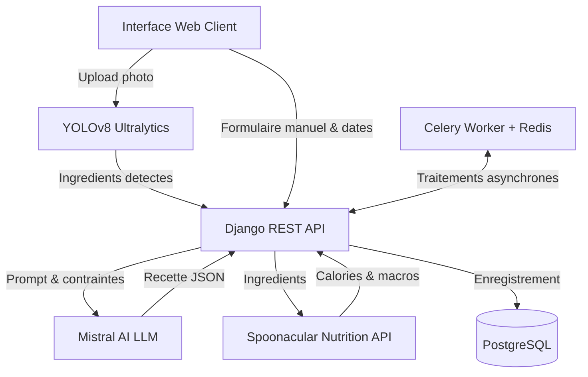
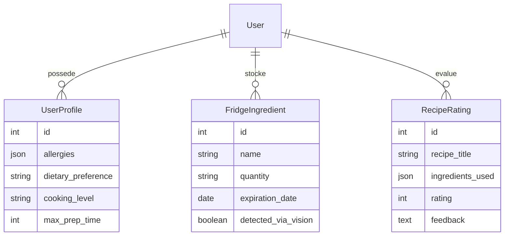

# CookPilot-AI

Plateforme web de generation de recettes anti-gaspillage basee sur la vision par ordinateur, un LLM et l'estimation nutritionnelle.

## Membres de l'equipe

| Nom et Prenom | Role | Responsabilites principal |
| --- | --- | --- |
| Jacqueline MAPENZI | Membre 1 | Backend Django, Moteur Vision YOLOv8, LLM Mistral, API Spoonacular, Celery |
| Aya SGHAIER | Membre 2 | UI/UX Design System, Interface utilisateur, Skeletons d'attente, Notation |
| Danielle Jamila Koagne Ngankam | Membre 3 | DevOps, Docker Compose, CI/CD GitHub Actions, Deploiement Render, Documentation |

- URL de production : https://cookpilot-ai.onrender.com
- Depot GitHub : https://github.com/104MJ/CookPilot-AI

## Architecture et fonctionnement

Le systeme combine une analyse d'image par vision artificielle et la generation de recettes personnalisees sous contraintes.

| Composant | Technologie | Role |
| --- | --- | --- |
| Backend API | Django 6, DRF | Gestion des profils, inventaire, orchestration des requetes |
| Vision Engine | YOLOv8 (ultralytics) | Detection automatique des ingredients depuis une photo |
| Moteur LLM | Mistral AI | Generation de recettes au format JSON sous contraintes d'allergies |
| Nutrition | API Spoonacular | Calcul automatique des calories et valeurs nutritionnelles |
| Async Worker | Celery & Redis | Traitement asynchrone des requetes d'inference longues |
| Base de donnees | PostgreSQL 16 | Persistance des profils, ingredients et evaluations |



## ORM et Modeles de donnees



## Guide de lancement local

### Prerequis
- Docker Desktop
- Git

### Installation et demarrage

1. Cloner le depot :
```bash
git clone https://github.com/104MJ/CookPilot-AI.git
cd CookPilot-AI
git checkout main
```

2. Creer le fichier d'environnement local :
```bash
cp .env.example .env
```

3. Completer les cles d'API dans `.env` :
- `MISTRAL_API_KEY`
- `SPOONACULAR_API_KEY`

4. Lancer les conteneurs :
```bash
docker compose up --build
```

L'application est disponible sur `http://localhost:8000`.

## Execution des tests unitaires

Les tests sont executables localement ou via Docker.

### Execution via Docker (recommande)
```bash
docker compose exec web python manage.py test
```

### Execution directe sur l'hote (si Python installe)
```bash
cd backend
python manage.py test
```

## Deploiement, Securite et Optimisations Cloud

- **Securite** : Les cles secrets (`.env`) sont exclues du depot Git via `.gitignore`.
- **Deploiement Cloud** : Gere automatiquement sur Render via `render.yaml`.
- **Integration Continue** : Gere par GitHub Actions (`.github/workflows/ci.yml`).
- **Optimisation Render (Limite 512 Mo RAM)** :
  - **Priorite a la saisie manuelle (Mode Leger)** : Assure une consommation memoire reduite (< 150 Mo RAM) pour s'adapter parfaitement aux limites de l'hebergeur gratuit Render.
  - **Entrainement deporte sur Google Colab** : L'entrainement lourd du modele YOLOv8 (Membre 1) est effectue hors-ligne sur GPU Colab, puis les poids optimises (`best.pt`) sont embarques dans le backend.
