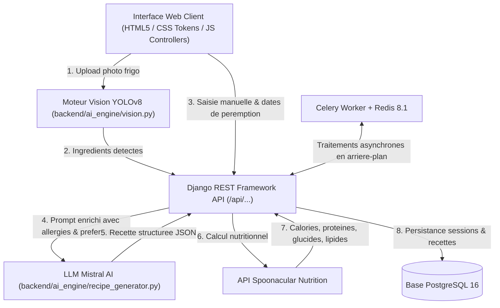
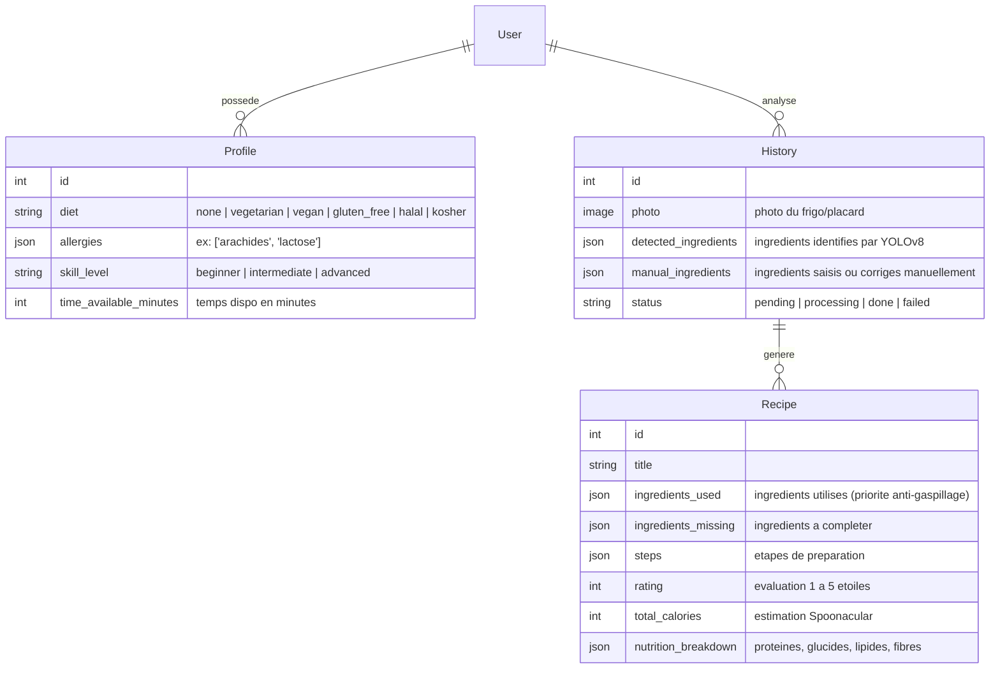

# CookPilot-AI

Plateforme web de generation de recettes anti-gaspillage basee sur la vision par ordinateur (YOLOv8), un modele LLM (Mistral AI), l'estimation nutritionnelle (Spoonacular) et un deploiement cloud conteneurise.

## Membres de l'equipe et Repartition des Roles

| Nom et Prenom | Role | Responsabilites Techniques |
| --- | --- | --- |
| Jacqueline MAPENZI | Membre 1 | Backend Django, Detection Vision YOLOv8 (Ultralytics), Generation LLM Mistral AI, Calcul Calories Spoonacular, Celery Worker |
| Aya SGHAIER | Membre 2 | UI/UX Design System (tokens CSS, layout), Templates HTML, Controllers JavaScript (`scan.js`, `result.js`, `history.js`), Vues Frontend |
| Danielle Jamila Koagne Ngankam | Membre 3 | DevOps, Conteneurisation Docker Compose, CI/CD GitHub Actions, Blueprint Deploiement Render, SecOps & Documentation |

- URL de production Live : https://cookpilot-ai.onrender.com
- Depot GitHub Public : https://github.com/104MJ/CookPilot-AI

## Architecture Technique et Moteur IA

L'application associe l'analyse d'image par vision artificielle et la generation de recettes personnalisees sous contraintes nutritionnelles et d'allergies.

| Composant | Technologie | Fichiers source / Role |
| --- | --- | --- |
| Backend API | Django 5.2 LTS, DRF 3.16 | `backend/config/`, `backend/ai_engine/views.py`, `backend/accounts/` |
| Vision Engine | YOLOv8 (Ultralytics) | `backend/ai_engine/vision.py` — Detection automatique des ingredients depuis une photo du frigo |
| Moteur LLM | Mistral AI API | `backend/ai_engine/recipe_generator.py` — Generation de recettes JSON personnalisees sous contraintes |
| Nutrition | API Spoonacular | `backend/ai_engine/spoonacular_nutrition.py` — Calcul exact des calories et macronutriments |
| Frontend UI | HTML5, CSS Tokens, JS | `backend/templates/`, `backend/static/css/`, `backend/static/js/`, `backend/pages/` |
| Async Worker | Celery 5.6 & Redis 8.1 | Traitement asynchrone des requetes d'inference et de generation |
| Base de donnees | PostgreSQL 16 | Persistance des profils utilisateurs, historiques d'analyse et recettes |

### Flux de Donnees de l'Application



## Modeles de Donnees ORM (Django)



## Guide de Lancement Local (Docker Compose)

### Prerequis
- Docker Desktop
- Git

### Installation et Demarrage

1. Cloner le depot :
```bash
git clone https://github.com/104MJ/CookPilot-AI.git
cd CookPilot-AI
```

2. Creer le fichier d'environnement local `.env` :
```bash
cp .env.example .env
```

3. Renseigner vos cles d'API dans `.env` :
- `MISTRAL_API_KEY` : obtenue sur https://console.mistral.ai/ (rubrique API Keys)
- `SPOONACULAR_API_KEY` : obtenue sur https://spoonacular.com/food-api (compte gratuit)

4. Lancer les conteneurs Docker :
```bash
docker compose up --build
```

L'application web est directement accessible sur `http://localhost:8000`.

## Scripts d'Entrainement YOLOv8 (Membre 1)

Le dossier `training/` contient les scripts d'entrainement hors-ligne du modele YOLOv8 pour la detection des ingredients :
- `training/download_dataset.py` : Telechargement du dataset Roboflow Universe (112 classes alimentaires, 46 674 images, licence CC BY 4.0).
- `training/train_yolov8.py` : Script de fine-tuning du modele `yolov8n.pt`.

L'entrainement est realise hors-ligne sur Google Colab GPU. Le fichier de poids genere (`ingredients_yolov8n.pt`) est ensuite place dans `backend/ai_engine/ml_models/`.

## Execution des Tests Automatises

La suite de tests unitaires valide les modeles ORM ainsi que l'ensemble des vues de l'API REST avec mocks.

### Execution via Docker (recommande)
```bash
docker compose exec web python manage.py test
```

### Resultats des Tests (9/9 OK)
```text
Found 9 test(s).
Creating test database for alias 'default'...
System check identified no issues (0 silenced).
.........
----------------------------------------------------------------------
Ran 9 tests in 10.723s

OK
```

## Deploiement, Securite SecOps et Optimisations Cloud

- **Securite des Secrets** : Les cles d'API (`MISTRAL_API_KEY`, `SPOONACULAR_API_KEY`) sont stockees exclusivement dans le fichier `.env` local (exclu de Git par `.gitignore`) et injectees dans les variables d'environnement Cloud sur Render.
- **Integration Continue (CI/CD)** : Le fichier `.github/workflows/ci.yml` execute automatiquement le linter `flake8` et la suite de 9 tests unitaires Django a chaque commit sur GitHub.
- **Deploiement Cloud (Render)** : Le blueprint `render.yaml` orchestre les 4 services Cloud (Web Gunicorn, Celery Worker, PostgreSQL 16 et Redis 8.1).
- **Optimisation Memoire Render (Limite 512 Mo RAM)** :
  - **Mode Leger avec Fallback Manuel** : Garantie d'une consommation memoire reduite (< 150 Mo RAM) adaptee aux contraintes de l'offre gratuite Render.
  - **Execution Non-Root & Conversion LF** : Le `Dockerfile` integre l'utilisateur non-root `django` et la conversion des fin de lignes Unix (`dos2unix`) pour prevenir tout bug de demarrage sous Linux.
